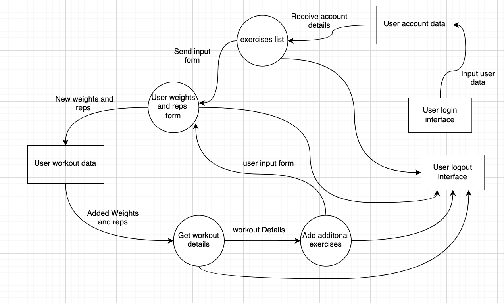
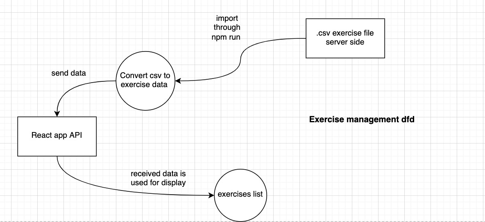

## R1.	Description of the app
- **Description and purpose:** The app our team will build is a fitness tracking app for athletes and workout enthusiasts. The purpose of the app is to help users to log their fitness performance for a variety of exercises including weight lifting, running and cycling. This app can help users set their fitness goals and track their performance over time.

- **Functionality / features:**
    1. User signup. A user enters their username, email, password, age, weight, height, and optionally their profile picture when signing up.
    2. User login. A user enter their email or username, and password to login.
    3. User signout.
    4. Select an exercise. A user can select their exercise that they want to keep track of.
    5. Exercise log entry. After a user selects their exercise, they can enter in the specific details of their exercise (e.g. weight and reps).

- **Target audience:** The target audience is anyone that wants to track their fitness.

- **Tech stack:** The technology stack used for this project is known as the MERN stack, which consists of MongoDB, ExpressJS, React, and NodeJS.

## R2.	Dataflow Diagram 

Dataflow diagram will help to have a visual representation of the flow of information in the application. It includes using various symbols to represent processes, data stores, external entities and data flow. 

**1. Process:**

It represents the logical processing of input data to produce and output data.

**2. Data store:**

It represents the data storage of inputs received from users that can be used for later use for retracting user information.

**3. External entities:**

These represent any flow of information or data from any other external organisation, application programming interface or system. These usually represent the edges of the DFD diagrams.

**4. Data flows:**

The data flow lines represent the input and output and the flow of data through processes, external entities and data stores.

App logic dfd

Exercise list dfd

## R3.	Application Architecture Diagram

## R4.	User Stories

1. As a customer, I should be able to login into my account, so that I can view my fitness performance.

2. As a new customer,  I should be able to sign up for the app, so that I can use the app.

3. As a customer, I should be able to safely log out from my account, so that I can ensure no one is able to use my account without permission.

4.  As a customer, I should be able to select an exercise, so that I can choose from different exercises that I wish to map for performance.

5. As a customer, I should be able to log the specific details of their exercise (e.g. weight and reps), so that I am able to track increasing weights used and reps for exercise.

## R5.	Wireframes for multiple standard screen sizes, created using industry standard software

## R6.	Screenshots of your Trello board throughout the duration of the project**